# OSS Contributions Card

A GitHub Action that finds your pull requests to other people's repositories and renders them as animated SVG cards in your own repo. There is no list to maintain: every run searches GitHub, so a pull request shows up when you open it and moves to the merged card when it lands.

It writes three cards:

- **Summary**: merged upstream, in review, projects contributed to, the combined stars of those projects, and a chip per project ranked by stars.
- **Merged**: repository, title and number of every merged pull request, newest first.
- **In review**: open pull requests, grouped by repository.

The cards are committed to your repo, so there is no widget host to run out of quota or go down. Each SVG is self-contained (CSS and SMIL animation only, no scripts, fonts or external images), which is what GitHub needs to render it through an ``.

## Preview

Live output for [@Sagargupta16](https://github.com/Sagargupta16), rendered on 2026-09-25 with `exclude-owners: MCA-NITW` and five one-line list repositories in `exclude-repos`:





## Quick start

Create `.github/workflows/oss-cards.yml` in the repo that shows the cards, usually your profile README repo:

```yaml
name: OSS contribution cards

on:
  schedule:
    - cron: "30 6 * * *" # daily
  workflow_dispatch:

permissions:
  contents: write

jobs:
  cards:
    runs-on: ubuntu-latest
    steps:
      - uses: actions/checkout@v7

      - uses: Sagargupta16/oss-contributions-card-action@v1
        with:
          exclude-owners: "your-org" # optional: owners whose repositories should not count

      - name: Commit the cards if they changed
        run: |
          git config user.name "github-actions[bot]"
          git config user.email "41898282+github-actions[bot]@users.noreply.github.com"
          git add assets/oss.svg assets/oss-merged.svg assets/oss-review.svg
          if ! git diff --cached --quiet; then
            git commit -m "chore: refresh oss contribution cards"
            git push
          fi
```

`username` defaults to the owner of the repo the workflow runs in and `token` to the workflow's own token, so in your own profile repo nothing else is required. The action only writes files; the last step commits them, and only when a card changed.

### Leave out list repositories

Adding your name to a list, like first-contributions or a portfolio collection, is a real merged pull request, so the search counts it. To keep those off the cards, list them in `exclude-repos`:

```yaml
      - uses: Sagargupta16/oss-contributions-card-action@v1
        with:
          exclude-owners: "your-org"
          exclude-repos: "firstcontributions/first-contributions, emmabostian/developer-portfolios, is-a-dev/*"
```

`owner/repo` drops one repository and `owner/*` drops every repository of that owner. Matching is case-insensitive, and it applies to the merged card, the in-review card, the summary counts and the action outputs alike.

## Embed

Point the images at the cards and wrap each one in a link to the matching GitHub search, so a click shows the pull requests behind it. Replace `YOUR-LOGIN` with your GitHub login:

```html
<a href="https://github.com/search?q=is%3Apr+author%3AYOUR-LOGIN+is%3Amerged+-user%3AYOUR-LOGIN&type=pullrequests">
  
</a>
<a href="https://github.com/search?q=is%3Apr+author%3AYOUR-LOGIN+is%3Amerged+-user%3AYOUR-LOGIN&type=pullrequests">
  
</a>
<a href="https://github.com/search?q=is%3Apr+author%3AYOUR-LOGIN+is%3Aopen+-user%3AYOUR-LOGIN&type=pullrequests">
  
</a>
```

If you exclude anything, add the same exclusions to each link so the search lists the same pull requests as the card: `+-user%3AOWNER` for every excluded owner (and every `owner/*` entry), and `+-repo%3AOWNER%2FREPO` for every excluded repository.

## Inputs

| Input | Default | Description |
| --- | --- | --- |
| `username` | `${{ github.repository_owner }}` | GitHub login whose pull requests are counted |
| `token` | `${{ github.token }}` | Token for the GitHub GraphQL API. The workflow's own token can read public pull requests |
| `exclude-owners` | `""` | Comma-separated owners whose repositories do not count, for example your own organizations |
| `exclude-repos` | `""` | Comma-separated repositories that do not count, as `owner/repo`, or `owner/*` for every repository of an owner. Case-insensitive |
| `output-summary` | `assets/oss.svg` | Path of the summary card. An empty string skips it |
| `output-merged` | `assets/oss-merged.svg` | Path of the merged card. An empty string skips it |
| `output-review` | `assets/oss-review.svg` | Path of the in-review card. An empty string skips it |
| `max-rows` | `12` | Most rows on each list card. The rest are summed in a footer line |
| `accent` | `""` | Hex color for the summary card's heading and project chips, for example `#a78bfa`. Empty keeps the stock blue. The merged and in-review cards stay green and amber so status reads at a glance |

## Outputs

| Output | Description |
| --- | --- |
| `merged` | Merged pull requests counted |
| `open` | Open pull requests counted |
| `projects` | Repositories with at least one merged pull request |
| `stars` | Combined stars of those repositories |

When the GitHub API fails and the action keeps your existing cards, it sets no outputs, so all four are empty strings.

## How it works

1. Runs two GitHub GraphQL searches, `is:pr author:USER is:merged -user:USER` and the same with `is:open`, following the cursor 100 results at a time.
2. Drops pull requests to repositories you own, to anything matched by `exclude-owners` or `exclude-repos` (case-insensitive), and to private repositories, even when the token can see them.
3. Renders the three cards. Projects are ranked by stars; merged pull requests are ordered by merge date; open ones are grouped by repository, the repository with the most open pull requests first.
4. Writes each card only when its content changed, so a quiet day produces no commit.

If the GitHub API fails (network error, HTTP error, rate limit, a GraphQL error), the action keeps the cards already in your repo, prints a warning and exits 0, so a flaky API never blanks your README. If a card does not exist yet, there is nothing to keep, and it exits 1 with a message naming the missing file.

Pull request titles are untrusted text: they are HTML-escaped before they go into an SVG, en and em dashes become plain hyphens, and emoji are dropped. The token is only sent to `https://api.github.com` and is never printed. The script is Python standard library only, so there is no dependency tree to audit.

## Limits

- **Public pull requests only.** Private repositories are always dropped, so nothing private reaches a public README.
- **1000 results per search.** GitHub's search API stops at 1000 results per query. Past that the counts are capped, and the run prints a warning with the real total.
- **Everything the search finds counts** unless you exclude it. That includes one-line additions to lists such as first-contributions, awesome lists or portfolio collections: see [Leave out list repositories](#leave-out-list-repositories).
- **Stars are today's stars**, not the count when your pull request merged.
- **The summary card shows four rows of project chips.** When there are more projects than fit, the last chip reads `+N more`. The tile above still counts every project.
- **Only pull requests you opened.** Reviews, issues and commits co-authored on someone else's pull request are not counted, and pull requests closed without merging are not shown.

## License

[MIT](LICENSE)
